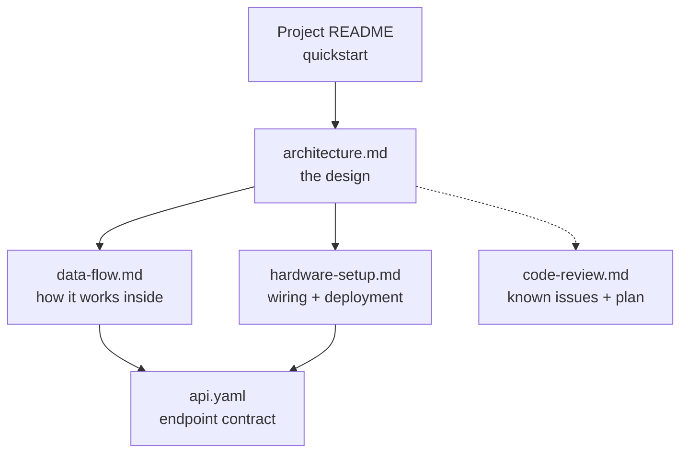

# Documentation

Documentation for the Cliff Face Scanner. Start with the document that matches
what you are trying to do.

## Map



## Documents

| Doc | Read it when you want to… | Audience |
|---|---|---|
| [`architecture.md`](./architecture.md) | Understand the overall design, the process split, and *why* it is built this way. | Everyone — start here. |
| [`data-flow.md`](./data-flow.md) | Trace how a request flows hardware → daemon → API → browser and back; understand threads, motion planning, the scan loop, faults. | Developers extending the code. |
| [`hardware-setup.md`](./hardware-setup.md) | Wire the Pi/drivers/LIDAR, deploy the software, and run first bench bring-up. **Merges** the old wiring, deployment, and bring-up docs. | Whoever assembles or deploys a scanner. |
| [`api.yaml`](./api.yaml) | Look up the exact HTTP endpoints, request/response shapes, and status codes (OpenAPI 3.1). | API consumers; paste into a Swagger viewer. |
| [`code-review.md`](./code-review.md) | See the audited bugs, error-handling and performance gaps, dead code, and the prioritised action plan. | Anyone fixing or hardening the system. |

## Quick orientation

The scanner is a two-axis LIDAR gantry run from a single Raspberry Pi 4B:

```
Browser ──HTTP──► control-api (Go, :8080) ──HTTP──► edge-daemon (C++, :9090) ──► GPIO/I²C ──► steppers + LIDAR
```

- **Tier 1** — `apps/web-ui`: a static browser dashboard, pure renderer.
- **Tier 2** — `apps/control-api`: Go broker; owns the operator lease, serves
  the UI, proxies to the daemon (or runs a built-in simulator).
- **Tier 3** — `apps/edge-daemon`: C++ service; owns all hardware, the scan
  state machine, and the safety supervisor.

For the project quickstart (flash an image, power on), see the
[top-level README](../README.md).
