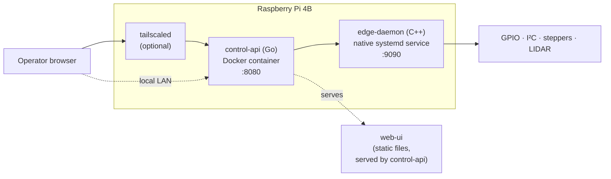

# Architecture

High-level design of the Cliff Face Scanner. For the *runtime* mechanics
(threads, request lifecycles, motion planning) see [`data-flow.md`](./data-flow.md);
for wiring and provisioning see [`hardware-setup.md`](./hardware-setup.md).

## Context & goals

An automated two-axis scanner that rasters a surface (geology/surveying use
case) with a LIDAR range sensor and presents the result as a live heatmap in a
browser. Design constraints:

- **Single Raspberry Pi 4B** — no separate microcontroller. The Pi drives the
  stepper drivers and reads the sensor directly.
- **One operator at a time**, lab/bench use. Safety via a control lease, a
  host watchdog, and fail-safe driver wiring.
- **Remote-operable** over Tailscale when the lab LAN cannot reach the device.
- **MVP** — JSON over localhost, no message bus, no database.

## Process split

The scanner runs as three processes on one Pi:

1. **`apps/edge-daemon`** — C++ service owning *all* hardware. Drives the
   TB6600 drivers via pigpio DMA waveforms, reads the LIDAR-Lite v3HP over
   I²C, runs the scan state machine and the safety supervisor. Exposes a
   localhost JSON API. The only process that touches GPIO.
2. **`apps/control-api`** — Go backend. Serves the web UI, enforces the
   single-operator control lease, and proxies hardware calls to the edge
   daemon. Can also run a built-in simulator with no daemon at all.
3. **`apps/web-ui`** — static, dependency-free browser dashboard.

## Why the edge daemon exists

Real-time hardware timing and fault handling are concentrated in one native
process so the web stack never has to deal with either. The edge daemon:

- owns all GPIO — step/dir pulses, the shared `ENABLE` line, the LIDAR
  trigger, the status LED;
- reads the LIDAR over I²C;
- runs the scan raster on a dedicated worker thread;
- runs a `SafetySupervisor` that drops `ENABLE` if the host stops
  heart-beating and pings the systemd watchdog;
- persists the motion envelope to `/etc/prism-scanner/hardware.json`.

If the daemon crashes, systemd restarts it; pigpio is torn down on exit, which
floats the TB6600 `ENABLE` line and fail-safes the drivers OFF.

## Key decisions & trade-offs

| Decision | Rationale | Trade-off |
|---|---|---|
| **Pi-native, no microcontroller** | One language fewer, no serial link, no firmware/host watchdog sync. The Pi + pigpio DMA gives microsecond pulse timing without an MCU. | Linux is not real-time; relies on the DMA engine for jitter-free pulses. |
| **Two processes (Go + C++)** | The web concern (routing, lease, static files) and the hardware concern (timing, faults) have different languages, lifecycles, and failure modes. | An extra localhost hop; two build toolchains. |
| **edge daemon native, control-api containerised** | The Go backend is a self-contained web process — ideal for repeatable, dependency-free Docker deploys. The daemon needs direct `/dev/i2c-*` + `/dev/gpiomem` access and host-level systemd watchdog integration, which fights containerisation. | Two deployment mechanisms (systemd unit + Compose). |
| **JSON over localhost, not gRPC** | Trivial to debug with `curl`; zero schema tooling for an MVP. | No schema enforcement; `proto/scanner/v1` exists but is unused. |
| **Snapshot-based UI** | The server's `Snapshot` is the single source of truth; the browser is a pure renderer with no client state machine. | The full grid ships on every 700 ms poll. |
| **Two interchangeable Go backends** | `sim` lets the whole UI run with no Pi; `edge` is the real path behind the same interface. | The sim is a parallel implementation that can drift. |

## Safety model

- **Control lease** — the Go API grants one operator at a time (120 s sliding
  expiry); other browsers see read-only state.
- **Host watchdog** — `SafetySupervisor` latches a fault after
  `host_watchdog_ms` with no `Heartbeat()` from the HTTP layer.
- **Systemd watchdog** — the same thread pings `WATCHDOG=1` every 100 ms;
  `WatchdogSec=2` restarts the unit if the thread stalls.
- **First-cause latching** — the first fault wins; later faults are swallowed
  so the root cause is not overwritten.
- **Fail-safe ENABLE** — TB6600 `ENABLE` is wired common-anode; the Pi sinks
  to assert. Process exit → pigpio terminates → GPIO floats → drivers OFF.

See [`data-flow.md`](./data-flow.md) §10 for the fault state machine.

## Configuration layering

- `/etc/prism-scanner/hardware.json` — loaded at boot: motion envelope, GPIO
  pin map, mechanics, safety timings, LIDAR I²C address, bind host/port. Seeded
  from `deploy/pi/hardware.json.example`.
- Motion limits are **hot-swappable** via `PUT /api/config/motion` and persist
  back to the same file. Pin maps, mechanics, and safety timings need a
  restart.
- `PRISM_HARDWARE_CONFIG` overrides the config path (used in tests).

Full field reference: [`hardware-setup.md`](./hardware-setup.md) §9.

## Known issues

This codebase has been through a vibe-coded MVP phase. A structured audit of
correctness, error handling, performance, and dead code lives in
[`code-review.md`](./code-review.md) — read it before extending the system.
