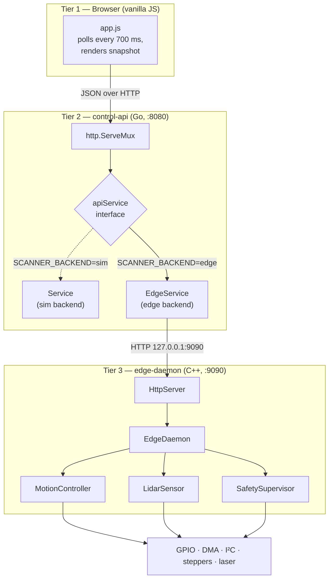
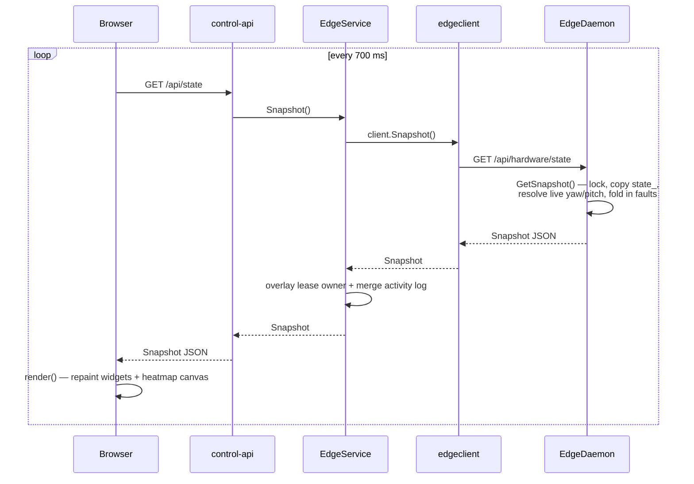
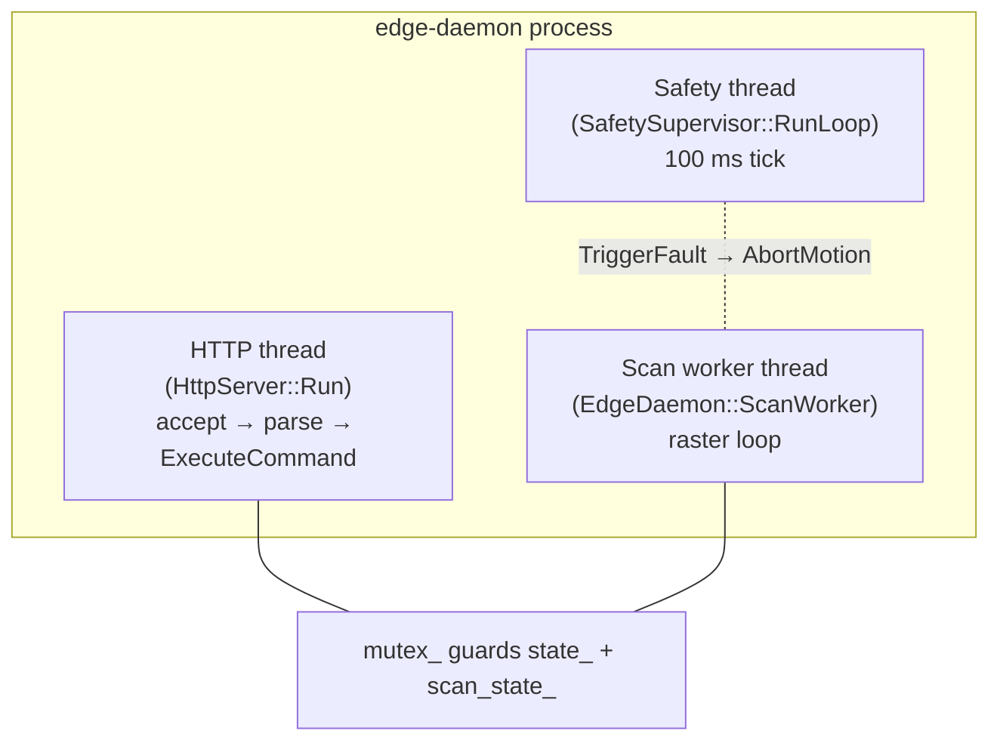
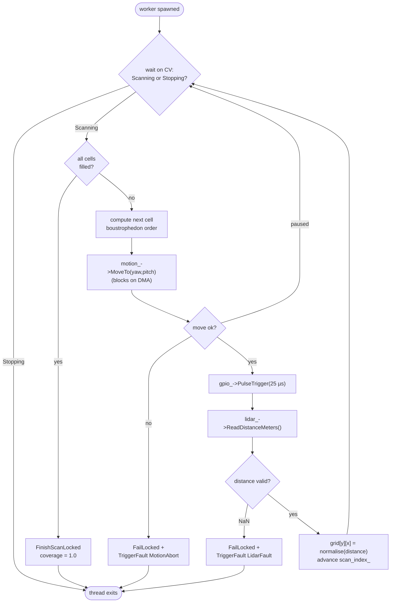
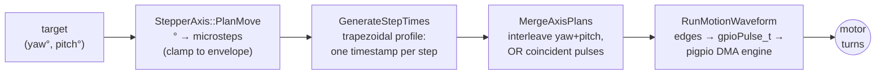
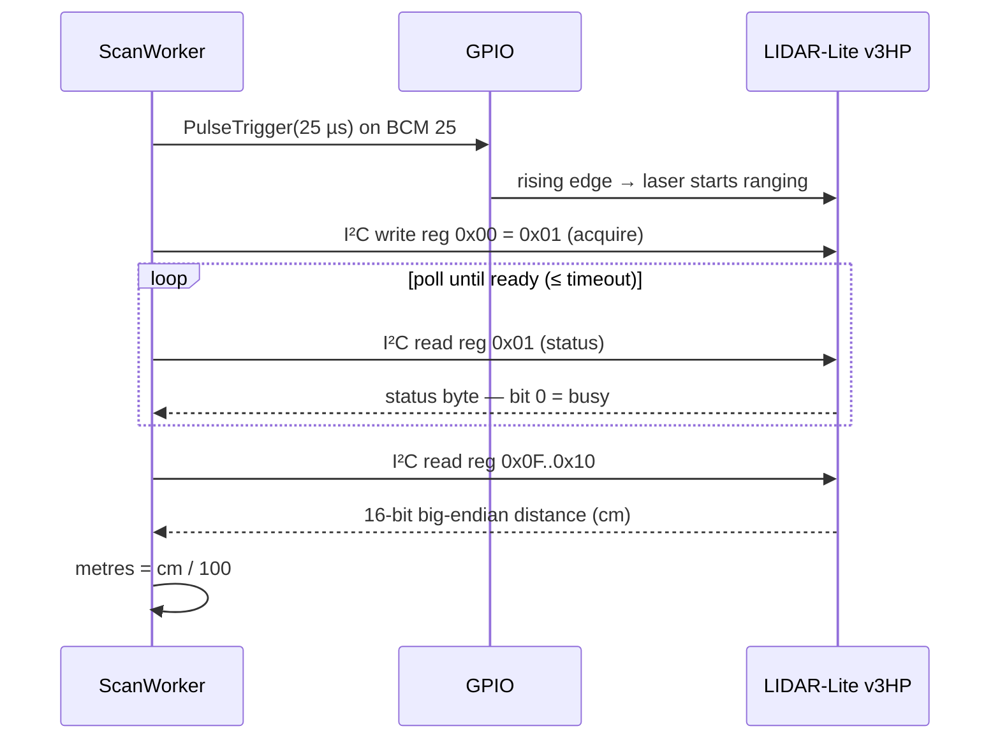
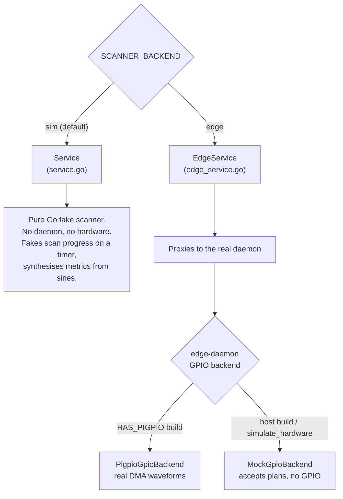
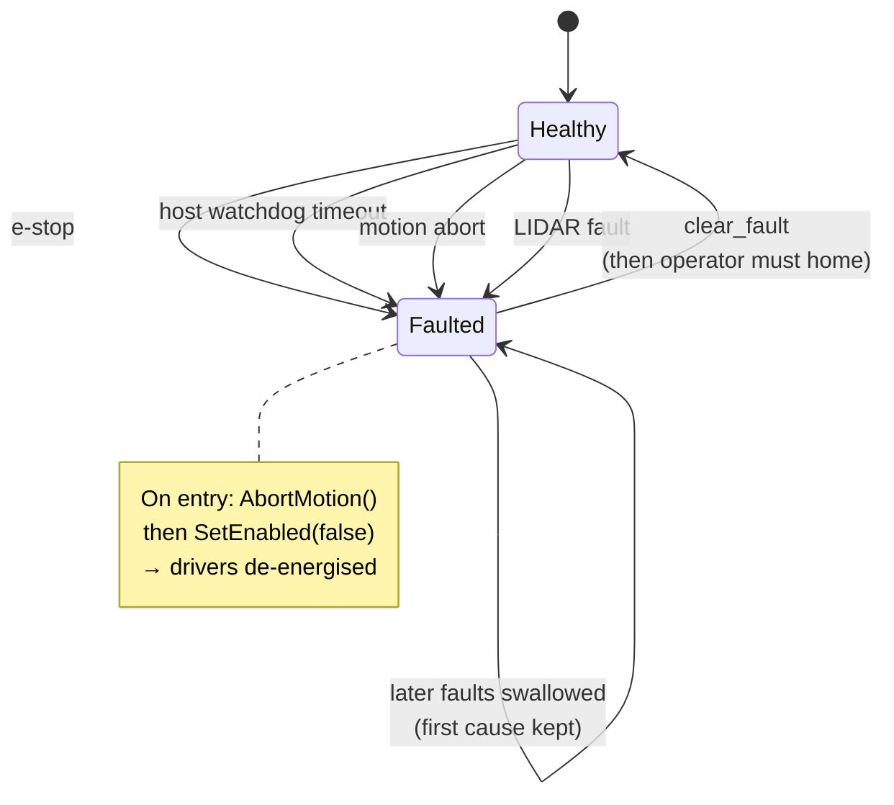

# Data Flow & Inner Workings

How a request travels from a browser click, through the API, into the C++
daemon, down to the motor and laser, and how state flows back. Read this after
[`architecture.md`](./architecture.md) (the *what*) to understand the *how*.

**Contents**

1. [The big picture](#1-the-big-picture)
2. [Component responsibilities](#2-component-responsibilities)
3. [Lifecycle of a command](#3-lifecycle-of-a-command)
4. [Lifecycle of a state poll](#4-lifecycle-of-a-state-poll)
5. [Inside the edge daemon — threads](#5-inside-the-edge-daemon--threads)
6. [The scan loop](#6-the-scan-loop)
7. [Motion: degrees → steps → DMA waveform](#7-motion-degrees--steps--dma-waveform)
8. [A LIDAR measurement](#8-a-lidar-measurement)
9. [The two backends — sim vs edge](#9-the-two-backends--sim-vs-edge)
10. [Safety & fault flow](#10-safety--fault-flow)
11. [The Snapshot — the shared data shape](#11-the-snapshot--the-shared-data-shape)

---

## 1. The big picture

Three tiers, three languages. Each tier only talks to its immediate neighbour.



The browser never knows whether it is talking to real hardware or the Go
simulator — the JSON shape is identical. That is the central design idea: a
single `Snapshot` contract (see §11) flows unchanged through every layer.

---

## 2. Component responsibilities

| Layer | File(s) | Owns | Does **not** own |
|---|---|---|---|
| Browser | `apps/web-ui/app.js` | Rendering, polling, input | Any state — it is a pure renderer |
| control-api | `apps/control-api/cmd/server/main.go` | HTTP routing, static files | Hardware, scan logic |
| `EdgeService` | `internal/scanner/edge_service.go` | The operator **lease**, a local log | Hardware state (proxied) |
| `Service` (sim) | `internal/scanner/service.go` | A full fake scanner | — |
| `edgeclient` | `internal/edgeclient/client.go` | HTTP calls to the daemon | — |
| `EdgeDaemon` | `apps/edge-daemon/src/edge_daemon.cpp` | The `Snapshot`, scan state machine | Pin-level timing |
| `MotionController` | `motion_controller.cpp` | Move planning, axis state | Pulse generation |
| `IGpioBackend` | `pigpio_*` / `mock_*` | Pulse/DMA generation | Anything above GPIO |
| `LidarSensor` | `lidar_sensor.cpp` | I²C ranging | — |
| `SafetySupervisor` | `safety_supervisor.cpp` | Watchdog, fault latch | — |

The **lease** lives in the Go layer (it is policy: *who* may drive). The
**hardware state** lives in the C++ layer (it is physics: *what* the machine
is doing). They are deliberately not mixed.

---

## 3. Lifecycle of a command

Tracing an operator pressing **Start Scan**. The browser holds the lease as
user `alice`.

```mermaid
sequenceDiagram
  participant B as Browser (app.js)
  participant G as control-api (Go)
  participant E as EdgeService
  participant C as edgeclient
  participant H as HttpServer (C++)
  participant D as EdgeDaemon
  participant W as ScanWorker thread

  B->>G: POST /api/command {user:"alice",command:"start_scan"}
  G->>E: Command("alice","start_scan",payload)
  E->>E: requireControlLocked("alice")  — lease check + renew
  E->>C: client.Command("start_scan",payload)
  C->>H: POST /api/hardware/command {command:"start_scan"}
  H->>D: ExecuteCommand(request, err)
  D->>D: safety_->Heartbeat()
  D->>D: scan_state_ = Scanning; spawn worker
  D-->>H: Snapshot (mode:"scanning")
  H-->>C: 200 {ok:true, state:{...}}
  C-->>E: Snapshot
  E->>E: decorate with lease + local log
  E-->>G: Snapshot
  G-->>B: 200 {ok:true, state:{...}}
  B->>B: render(snapshot)
  Note over W: worker now rasters cells<br/>independently of this request
```

Key points:

- **The lease is enforced in Go**, before the request ever reaches the daemon.
  Every command except `connect` calls `requireControlLocked`, which both
  checks ownership and *renews* the 120 s expiry (a sliding window).
- `start_scan` returns **immediately** — the actual scan runs on a worker
  thread. Contrast with `home`/`jog`, which block the daemon's HTTP thread
  until the move finishes (see [`code-review.md`](./code-review.md) B8).
- Every command into the daemon counts as a `Heartbeat()` and resets the host
  watchdog.

---

## 4. Lifecycle of a state poll

The browser polls `GET /api/state` every 700 ms. This is read-only and needs
no lease.



The daemon's `GetSnapshot()` copies `state_` under a mutex and asks the
`MotionController` for the *current* yaw/pitch (resolved live, not cached), so
position is always fresh. If the daemon is unreachable, `EdgeService` returns
the last known snapshot with `connected:false` and an "Edge daemon
unavailable" fault appended — the UI degrades instead of going blank.

> The full grid (~1150 cells) is serialised on **every** poll even when
> nothing changed — see [`code-review.md`](./code-review.md) §4 for the
> optimisation plan.

---

## 5. Inside the edge daemon — threads

The daemon runs **three** threads of interest:



**Lock discipline** (the one rule that keeps this safe): `mutex_` guards
`state_` and `scan_state_`. It is **never held** across a `MoveTo` or a LIDAR
read — those block for many milliseconds, and `GetSnapshot` (HTTP polls) must
stay responsive. The worker takes the lock, reads what cell to do next,
*releases* it, performs the slow move/read, then re-takes the lock to write
the result.

The HTTP server itself is **single-threaded**: one request at a time. Fine for
one operator polling + clicking, but a blocking `home` stalls polls for the
move's duration (B8).

---

## 6. The scan loop

`EdgeDaemon::ScanWorker` is the heart of a scan. It walks the grid in
**boustrophedon** order — every other row is reversed so the head snakes back
and forth instead of carriage-returning, halving total travel.



- **Pause** is cooperative: `pause_scan` sets `scan_state_ = Paused`; the
  worker finishes the current cell, sees `Paused`, and re-parks on the
  condition variable. Motion is *not* aborted, so position tracking stays
  exact across pause/resume.
- **Stop / e-stop** set `Stopping` and call `AbortMotion()`, which halts the
  DMA waveform mid-move. The worker sees `Stopping` and exits.

### Scan density (resolution presets)

The grid the worker rasters is not a fixed size — it is derived from hardware.
`set_resolution` picks a **preset** that maps to a *sampling stride* in
microsteps (`EdgeDaemon::ApplyResolutionLocked`):

| Preset | Stride | Meaning |
|---|---|---|
| `coarse` | 4 full steps | fast survey |
| `standard` | 1 full step | default |
| `fine` | ⅛ full step | detailed |
| `max` | 1 microstep | finest the driver can resolve |

The grid dimensions fall out of the stride and the motion range:
`cols = yaw_range° × microsteps_per_deg ÷ stride`, likewise for rows. So a
finer preset — or a wider envelope — produces more sample cells and a longer
scan. A per-microstep scan over the full envelope is tens of millions of
cells, so the stored grid is clamped to `kMaxScanCells` (300 000) with a
logged warning; genuine per-microstep detail comes from scanning a *small*
yaw/pitch range. The web UI shows the resulting grid size and time estimate
live under the density selector.

---

## 7. Motion: degrees → steps → DMA waveform

A move target in degrees becomes precisely-timed GPIO edges. Four stages:



1. **PlanMove** (`stepper_axis.cpp`) converts the clamped target angle to an
   integer microstep count using
   `microsteps_per_deg = full_steps × microsteps × gear_ratio / 360`, and the
   delta from the current position gives step count + direction.
2. **GenerateStepTimes** builds a **trapezoidal velocity profile** — a vector
   with one timestamp (µs from move start) per step:
   - accel phase: `t(i) = √(2i / a)`
   - cruise phase: linear at `v_max`
   - decel phase: mirror of accel around the midpoint

   ```
   velocity
     v_max │      ┌────────────┐
           │     ╱              ╲
           │    ╱                ╲
         0 │   ╱                  ╲
           └──┴──────────────────┴────► time
            accel     cruise     decel
   ```
3. **MergeAxisPlans** (`motion_controller.cpp`) interleaves the yaw and pitch
   timestamp lists into one sorted stream. Pulses landing in the same
   microsecond are OR-ed into a combined axis bitmask, so both motors can step
   on a single DMA entry.
4. **RunMotionWaveform** (`pigpio_gpio_backend.cpp`) expands each pulse into an
   assert edge + a deassert edge, converts the edge list to `gpioPulse_t`
   records, and submits them to pigpio's **DMA waveform engine**. The DMA
   hardware then clocks out every edge with microsecond accuracy *without CPU
   involvement* — which is how a non-real-time Linux box drives steppers
   cleanly. `MoveTo` busy-waits on `gpioWaveTxBusy()` until the DMA drains or
   an abort fires.

On a successful waveform the axis `Commit`s the new position; on an abort it
calls `MarkPositionUnknown()` (the motor stopped mid-move, so the tracked
count is stale — the operator must re-home).

---

## 8. A LIDAR measurement

Per grid cell, after the move settles:



- The **hardware trigger** (25 µs HIGH on BCM 25) pre-warms the laser in
  parallel with the I²C setup, shaving a few ms per cell.
- The **I²C acquire** (`write 0x00 = 0x01`) starts the same measurement —
  redundant with the trigger but harmless, and matches Garmin's reference
  library.
- **Status polling** reads register `0x01`; bit 0 is the busy flag. The daemon
  polls every 2 ms until it clears.
- **Distance** comes from registers `0x0F` (high) / `0x10` (low) as a
  big-endian centimetre count; a single 2-byte read auto-increments the
  register pointer.

The whole sequence is ~20–30 ms; the daemon budgets `per_point_ms = 80 ms`
(move + settle + trigger + read) when estimating total scan duration.

Any I²C error returns `NaN`, which the scan worker treats as a hard
`LidarFault` — see [`code-review.md`](./code-review.md) B11 for why a bounded
retry belongs here.

---

## 9. The two backends — sim vs edge

`SCANNER_BACKEND` (env var, read in `main.go`) selects which `apiService`
implementation the control-api uses. There are **two completely separate
simulators** in the codebase — do not confuse them:



| Simulator | Where | Use it for |
|---|---|---|
| **Go `Service`** | `control-api`, `SCANNER_BACKEND=sim` | UI/demo work with no daemon at all |
| **Mock GPIO/LIDAR** | `edge-daemon`, host build or `simulate_hardware:true` | Exercising the *real* daemon logic without a Pi |

The Go `Service` is a parallel reimplementation of the scan logic and can
drift from the daemon — flagged in [`code-review.md`](./code-review.md) §5.

---

## 10. Safety & fault flow

Faults are a **latch**: the first fault wins and is held until an explicit
`clear_fault`. This preserves the root cause instead of letting a cascade
overwrite it.



Three independent guards:

| Guard | Mechanism | Trips when |
|---|---|---|
| **Control lease** | Go `requireControlLocked` | A non-owner sends a command (rejected, not a fault) |
| **Host watchdog** | `SafetySupervisor`, 100 ms tick | No `Heartbeat()` within `host_watchdog_ms` (1500 ms) |
| **Systemd watchdog** | `WATCHDOG=1` to `$NOTIFY_SOCKET` | The safety thread itself stalls → systemd restarts the unit |

`Heartbeat()` is currently called only from `ExecuteCommand` — see
[`code-review.md`](./code-review.md) **B1** for why an idle scanner can
false-trip the host watchdog, and the fix.

---

## 11. The Snapshot — the shared data shape

One JSON object is the contract across all three tiers. The daemon emits it,
the Go layer decorates it (lease owner, merged log), the browser renders it.
Field names are camelCase on the wire.

```jsonc
{
  "connected": true,
  "mode": "scanning",                 // idle | manual | scanning | paused | fault
  "controlOwner": "alice",            // set by the Go layer, not the daemon
  "controlLeaseExpiresAt": "2026-05-18T12:00:00Z",
  "yaw": 12.4, "pitch": -3.1,         // live, resolved from MotionController
  "coverage": 0.42,                   // fraction of grid cells filled
  "scanProgress": 0.42,
  "scanDurationSeconds": 92.16,
  "lastCompletedScanAt": null,
  "scanSettings": { "yawMin": -50, "yawMax": 50, "pitchMin": -30,
                    "pitchMax": 30, "sweepSpeedDegPerSec": 12,
                    "resolution": "medium" },
  "metrics": { "motorTempC": 35.2, "motorCurrentA": 1.45, "lidarFps": 12,
               "radarFps": 0, "latencyMs": 80, "packetsDropped": 0 },
  "faults": [],
  "activity": [ { "source": "scanner", "ts": "...", "message": "Scan started.",
                  "level": "info" } ],
  "grid": [ [ -1, -1, 0.83, ... ], ... ]   // -1 = unmeasured cell
}
```

Notes for anyone extending it:

- `controlOwner` / `controlLeaseExpiresAt` are **owned by the Go layer**. The
  daemon leaves them blank; `EdgeService.decorateSnapshotLocked` fills them in.
- `metrics` values from the real daemon are **synthesised, not measured** —
  see [`code-review.md`](./code-review.md) §5. `radarFps` and `packetsDropped`
  are vestigial (there is no radar).
- `grid` cells are `-1` until measured, then a normalised 0..1 confidence.
- The machine-readable endpoint contract is [`api.yaml`](./api.yaml)
  (OpenAPI 3.1).
