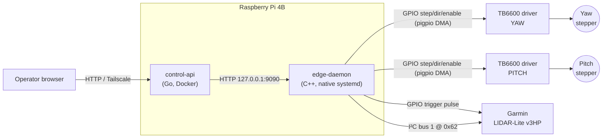

# Hardware Setup & Pi Deployment

Everything needed to take a bare Raspberry Pi 4B, two TB6600 stepper drivers,
and a Garmin LIDAR-Lite v3HP from parts on a bench to a running scanner.

This is the **single source of truth** for wiring, provisioning, configuration,
and first-power-on bring-up. It replaces the older `hardware-pins.md`,
`pi-deployment.md`, and `lab-bringup.md` (the latter assumed an Arduino Mega
that no longer exists — the Pi now drives all hardware directly).

**Contents**

1. [Topology](#1-topology)
2. [GPIO pin map](#2-gpio-pin-map)
3. [Wiring the TB6600 drivers](#3-wiring-the-tb6600-drivers)
4. [Wiring the LIDAR-Lite v3HP](#4-wiring-the-lidar-lite-v3hp)
5. [Status LED](#5-status-led)
6. [Pre-power-on electrical checks](#6-pre-power-on-electrical-checks)
7. [Deployment — flash a pre-baked image](#7-deployment--flash-a-pre-baked-image)
8. [Deployment — build from source](#8-deployment--build-from-source)
9. [Configuration (`hardware.json`)](#9-configuration-hardwarejson)
10. [First bench bring-up checklist](#10-first-bench-bring-up-checklist)
11. [Simulation mode (no hardware)](#11-simulation-mode-no-hardware)
12. [Health checks & troubleshooting](#12-health-checks--troubleshooting)
13. [Deployment assets reference](#13-deployment-assets-reference)

---

## 1. Topology

No microcontroller sits in the motion or sensor path. The Pi is the only
compute element.



| Part | Role |
|---|---|
| Raspberry Pi 4B | Runs both services; drives all GPIO + I²C |
| 2× TB6600 stepper driver | Power stage for the yaw and pitch steppers |
| 2× NEMA stepper motor | Yaw and pitch axes of the gantry |
| Garmin LIDAR-Lite v3HP | Range sensor, I²C + hardware trigger |
| 680–1000 µF electrolytic cap | LIDAR power-rail decoupling (**required**) |

---

## 2. GPIO pin map

All GPIO numbers are **BCM** (what `pigpio` and `gpio readall` use). This is
what `DefaultConfig()` in `hardware_config.cpp` ships; every pin is
overridable in `/etc/prism-scanner/hardware.json`.

| Signal | BCM | Physical | Dir | Target |
|---|---|---|---|---|
| `yaw_step` | 17 | 11 | OUT | TB6600 yaw `PUL−` |
| `yaw_dir` | 27 | 13 | OUT | TB6600 yaw `DIR−` |
| `pitch_step` | 22 | 15 | OUT | TB6600 pitch `PUL−` |
| `pitch_dir` | 23 | 16 | OUT | TB6600 pitch `DIR−` |
| `enable` | 24 | 18 | OUT | Both drivers `ENA−` (shared) |
| `lidar_trigger` | 25 | 22 | OUT | LIDAR-Lite `MODE/TRIG` |
| `status_led` | 18 | 12 | OUT | External status LED (optional) |
| I²C `SDA` | 2 | 3 | I/O | LIDAR-Lite `SDA` |
| I²C `SCL` | 3 | 5 | I/O | LIDAR-Lite `SCL` |

The Pi also supplies **3.3 V** to the on-board I²C pull-ups and **5 V** to the
LIDAR.

---

## 3. Wiring the TB6600 drivers

The TB6600 opto-isolators need ~8–15 mA through the input LED. Driving them
*common-cathode* (Pi sources current) at 3.3 V only pushes ~2 mA — too
marginal. Wire them **common-anode** so the Pi *sinks* current:

```
        +5 V ─────┬──── PUL+   (and DIR+, ENA+, all tied together)
                  │
                  └──── 220 Ω  (optional — TB6600 has internal limiting R)
                        │
                        └──► PUL−  ── Pi BCM GPIO (output)

  Pi GPIO LOW  → current flows through opto → driver sees "asserted"
  Pi GPIO HIGH → current blocked            → driver sees "idle"
```

This inversion ("Pi LOW = asserted") is why the config defaults are:

| Key | Value | Reason |
|---|---|---|
| `step_active_low` | `true` | A step pulse is a LOW pulse |
| `enable_active_low` | `true` | Holding `ENA−` LOW energises the motor |
| `dir_active_low` | `false` | Direction is a level, not a pulse; no inversion keeps the gantry's mechanical convention consistent |

**Microstepping.** Set both drivers' S1/S2/S3 DIP switches to the same value
and make `mechanics.microsteps` in `hardware.json` match. The default is
**128** — see [§9](#9-configuration-hardwarejson).

**Fail-safe on power loss / daemon exit.** On a clean exit `pigpio` releases
the GPIOs; the un-driven `ENA−` line floats HIGH through the `PUL+` tie and
the driver reads "disabled" (motors freewheel). On a crash, the systemd
watchdog (`WatchdogSec=2`) restarts the daemon within 2 s. Any latched fault
calls `AbortMotion()` → `gpioWaveTxStop()` (DMA clears in <1 µs) then
`SetEnabled(false)`.

---

## 4. Wiring the LIDAR-Lite v3HP

### Connector

The v3HP has a **6-pin JST PH 2.0 mm** connector (J1). Garmin ships a pigtail
harness.

| J1 | Wire | Signal | Connect to | Notes |
|---|---|---|---|---|
| 1 | Red | 5 V | Pi 5 V (phys pin 2/4) | 4.5–5.5 V, up to 85 mA peak |
| 2 | Black | GND | Pi GND (phys pin 6/9/14…) | **Shared ground with the Pi** |
| 3 | Orange | PWR_EN | Leave floating | Internal 10 kΩ pull-up keeps sensor on |
| 4 | Yellow | MODE/TRIG | BCM 25 / phys 22 | Hardware trigger input |
| 5 | Blue | SDA | BCM 2 / phys 3 | 3.3 V logic, pull-up on Pi |
| 6 | Green | SCL | BCM 3 / phys 5 | 3.3 V logic, pull-up on Pi |

> **Required: fit a 680 µF (or 1000 µF) electrolytic capacitor between the
> LIDAR's 5 V and GND wires, as close to the sensor as possible.** The laser
> draws up to 85 mA in short bursts; without the cap the spike droops the rail
> and causes intermittent I²C errors or Pi brown-outs. These symptoms are easy
> to misdiagnose as software bugs.

> **Common ground.** The LIDAR's GND **must** tie to the Pi's GND. A missing
> common ground produces `i2c write failed: input/output error`.

### MODE / TRIG (yellow)

Driving this pin HIGH for ≥1 µs starts a ranging measurement immediately, with
no I²C write. The daemon pulses it for **25 µs** (`lidar_trigger_pulse_us`) for
margin. The pin can also be read as a busy/ready output; the daemon does not
use that direction.

### I²C address

Factory default **0x62** (decimal 98). `hardware.json` key
`"i2c_address": 98`. The daemon talks to it on `/dev/i2c-1`.

---

## 5. Status LED

`status_led` (BCM 18) is reserved in the pin map and the backend exposes a
`SetStatusLed(bool)` method, but **no code path currently drives it**. The pin
is set OUTPUT/LOW at startup. Wire a resistor + LED to 3.3/5 V if you want it;
set `"status_led": 0` to disable the pin entirely.

---

## 6. Pre-power-on electrical checks

1. **Confirm the LIDAR is on 5 V**, not 3.3 V. Meter it before plugging in —
   the Pi's 5 V rail (phys pin 2/4) is unfused and always live.
2. **Fit the 680–1000 µF cap** between LIDAR 5 V and GND.
3. **Verify common ground** between the LIDAR supply and the Pi.
4. **Confirm the I²C address** with `i2cdetect -y 1` — expect `0x62`. `UU`
   means a kernel driver claimed it; unload that driver.
5. **Probe the TB6600 control lines** with the daemon in
   `"simulate_hardware": true` — `PUL−/DIR−/ENA−` should idle at 3.3 V. A logic
   analyser confirms the 4 µs step-pulse width and DMA timing.
6. **Decouple the motors mechanically**, switch to
   `"simulate_hardware": false`, and jog one axis +1°. Listen for the stepper
   "tick"; watch `journalctl -u cliffscanner-edge -f`.

---

## 7. Deployment — flash a pre-baked image

The fastest path. Zero on-device setup beyond wiring.

1. Download the latest release `.img.xz` from
   <https://github.com/Gabriel-Karpinsky/Prism-FullStack/releases>:
   - `cliffscanner-pi-aarch64-lite-vX.Y.Z.img.xz` — production (headless).
   - `cliffscanner-pi-aarch64-desktop-vX.Y.Z.img.xz` — bench testing over HDMI.
2. *(Optional, for remote access)* Generate a Tailscale auth key at
   <https://login.tailscale.com/admin/settings/keys>. A **reusable, ephemeral,
   pre-authorised** key is safest — it auto-expires and cannot be replayed off
   the card.
3. Flash with **Raspberry Pi Imager**: "Choose OS" → "Use custom" → the
   `.img.xz`. Open the settings cog (Ctrl-Shift-X) and set SSH, username/
   password, and WiFi. Imager injects these at flash time so no credentials
   are baked into the public release.
4. **Before ejecting**, drop the Tailscale key onto the boot partition as a
   file named `tailscale-authkey`:
   ```
   echo "tskey-auth-...your-key..." > /Volumes/bootfs/tailscale-authkey   # macOS
   ```
   On Windows the boot partition appears as a drive letter — create the file
   there (plain UTF-8, no BOM).
5. Insert the card, power on. First boot:
   - resizes the root filesystem,
   - sets hostname `cliffscanner-XXXXXX` (last 6 hex of the eth0 MAC),
   - if `tailscale-authkey` is present: joins the tailnet with `--ssh`, then
     **shreds the key file**,
   - starts `cliffscanner-edge` and `cliffscanner-control-api`.
6. After ~90 s, find the device in the Tailscale console (or on the LAN), SSH
   in, and run the [smoke checks](#12-health-checks--troubleshooting).

How the image is built (CI): see `.github/workflows/build-image.yml` — a tag
push cross-compiles the control-api container, bakes it into a Raspberry Pi OS
image via CustoPiZer + qemu, and attaches the `.img.xz` to a GitHub Release.

---

## 8. Deployment — build from source

For iterating on the daemon on a running Pi.

### Prerequisites

```bash
sudo apt update
sudo apt install build-essential pigpio libpigpio-dev nlohmann-json3-dev \
                 i2c-tools docker.io docker-compose-plugin
sudo raspi-config nonint do_i2c 0      # enable I²C bus 1
sudo usermod -aG i2c "$USER"
```

Confirm `/boot/config.txt` (or `/boot/firmware/config.txt`) has
`dtparam=i2c_arm=on`.

### Install

1. Clone the repo to `/opt/cliffscanner`.
2. Wire the hardware per §3–§5.
3. Install the edge daemon (builds with `HAS_PIGPIO=1`):
   ```bash
   sudo bash /opt/cliffscanner/deploy/pi/install-edge-daemon.sh
   ```
4. Install the Go backend container:
   ```bash
   sudo bash /opt/cliffscanner/deploy/pi/install-control-api-service.sh
   ```
5. *(Optional)* `sudo bash /opt/cliffscanner/deploy/pi/configure-tailscale-serve.sh`

The edge-daemon installer builds with `HAS_PIGPIO=1` and installs to
`/opt/cliffscanner/bin/`, seeds `/etc/prism-scanner/hardware.json` from the
example (later edits survive reinstalls), seeds
`/etc/cliffscanner/edge-daemon.env`, and disables `pigpiod` (the daemon uses
the pigpio library in-process).

### Rebuild a single component without re-flashing

```bash
# edge-daemon
cd /opt/cliffscanner/apps/edge-daemon
make clean && make HAS_PIGPIO=1
sudo make install HAS_PIGPIO=1
sudo systemctl restart cliffscanner-edge

# control-api (container)
sudo systemctl restart cliffscanner-control-api
```

---

## 9. Configuration (`hardware.json`)

Runtime config lives at `/etc/prism-scanner/hardware.json`, loaded at boot.
The `PRISM_HARDWARE_CONFIG` env var overrides the path (handy for tests).

```json
{
  "motion": {
    "yaw":   {"min_deg": -50, "max_deg": 50, "max_speed_deg_s": 18, "accel_deg_s2": 60},
    "pitch": {"min_deg": -30, "max_deg": 30, "max_speed_deg_s": 12, "accel_deg_s2": 40}
  },
  "mechanics": {"full_steps_per_rev": 200, "microsteps": 128, "yaw_gear_ratio": 1.0, "pitch_gear_ratio": 1.0},
  "gpio":     {"yaw_step": 17, "yaw_dir": 27, "pitch_step": 22, "pitch_dir": 23,
               "enable": 24, "lidar_trigger": 25, "status_led": 18,
               "step_active_low": true, "dir_active_low": false, "enable_active_low": true},
  "safety":   {"host_watchdog_ms": 1500, "step_pulse_us": 4, "lidar_trigger_pulse_us": 25},
  "lidar":    {"i2c_bus": 1, "i2c_address": 98, "simulate": false},
  "service":  {"bind_host": "127.0.0.1", "bind_port": 9090,
               "grid_width": 48, "grid_height": 24,
               "tick_interval_ms": 20, "status_broadcast_interval_ms": 100},
  "simulate_hardware": false
}
```

> **`mechanics.microsteps`.** Defaults to **128**. Set the TB6600 S1/S2/S3 DIP
> switches to 128 to match — a mismatch makes every move travel the wrong
> distance. Moves long enough to exceed pigpio's single-waveform limit (~12 000
> pulses) are split into chunks and chained automatically by the daemon, so any
> move size works at 128; see [`data-flow.md`](./data-flow.md) §7.

**Microstep math.** The daemon converts degrees to step pulses with:

```
microsteps_per_deg = (full_steps_per_rev × microsteps × gear_ratio) / 360
```

So at `200 × 128 × 1.0 / 360 ≈ 71.11` microsteps per degree.

### What is hot-swappable vs restart-required

| Field group | Change applies |
|---|---|
| `motion.*` (limits, speed, accel) | **Hot** — `PUT /api/config/motion`, persisted to disk |
| `mechanics.*`, `gpio.*`, `safety.*`, `lidar.*`, `service.*` | Requires `sudo systemctl restart cliffscanner-edge` |

Hot-swap example:

```bash
# Read current envelope
curl -s http://127.0.0.1:8080/api/config/motion | jq

# Write (requires the caller to hold the control lease)
curl -s -X PUT http://127.0.0.1:8080/api/config/motion \
     -H 'Content-Type: application/json' \
     -d '{"user":"alice",
          "motion":{"yaw":  {"min_deg":-40,"max_deg":40,"max_speed_deg_s":15,"accel_deg_s2":50},
                    "pitch":{"min_deg":-25,"max_deg":25,"max_speed_deg_s":10,"accel_deg_s2":35}}}'
```

A hot-swap is rejected if the gantry's current position lies outside the
proposed envelope — home first.

---

## 10. First bench bring-up checklist

Run this for the first power-on of an assembled scanner. Keep a hand near the
power switch and reduce the motion envelope before full travel.

**a. Both services up**

```bash
systemctl is-active cliffscanner-edge          # active
systemctl is-active cliffscanner-control-api   # active
curl -s http://127.0.0.1:9090/health           # {"ok":true}
curl -s http://127.0.0.1:8080/healthz          # {"ok":true}
```

**b. Hardware state sane**

```bash
curl -s http://127.0.0.1:9090/api/hardware/state | jq '{connected,mode,faults}'
```

`connected` should be `true`, `mode` not `fault`, `faults` empty.

**c. Motion test** (from the web UI)

1. Acquire control.
2. Jog yaw +, then yaw −.
3. Jog pitch +, then pitch −.
4. Home back to zero.
5. Confirm the reported yaw/pitch follow the physical gantry direction. If an
   axis runs backwards, flip `dir_active_low` for that axis or swap the driver
   `DIR` wiring.

**d. First scan** (resolution `low`)

1. Set resolution to `low`, start the scan.
2. Confirm the gantry rasters in a back-and-forth (boustrophedon) pattern.
3. Confirm `coverage` and `scanProgress` climb.
4. Confirm the browser heatmap fills cell by cell.

**e. LIDAR validation** — if motion is fine but map values look wrong:

- check `lidar.i2c_bus` / `lidar.i2c_address` in `hardware.json`,
- `i2cdetect -y 1` should show `0x62`,
- confirm stable LIDAR power, the decoupling cap, and the common ground,
- temporarily set `"simulate": true` under `lidar` to isolate motion from
  sensor problems.

**f. Safety checks**

- Stop the edge daemon (or let polling lapse) and confirm the host watchdog
  latches a fault and drops `ENABLE`.
- Trigger `ESTOP` from the UI; confirm the gantry stops immediately.
- Use `CLEAR_FAULT` only once the mechanism is safe, then **home** before any
  further move (an aborted move leaves axis positions untrusted).

---

## 11. Simulation mode (no hardware)

Two independent simulators exist — see [`data-flow.md`](./data-flow.md) §9.

**Mock GPIO/LIDAR backend** — build the daemon without pigpio, or flip
`"simulate_hardware": true`:

```bash
cd apps/edge-daemon
make clean && make          # HAS_PIGPIO unset ⇒ mock backend
./cliffscanner-edge         # listens on 127.0.0.1:9090
```

**Go in-process simulator** — run the control-api with no daemon at all:

```powershell
powershell -ExecutionPolicy Bypass -File .\deploy\run-go-backend.ps1 -Port 8080
```

Browse to `http://localhost:8080`.

---

## 12. Health checks & troubleshooting

```bash
curl -s http://127.0.0.1:9090/health             # edge-daemon liveness
curl -s http://127.0.0.1:9090/api/hardware/state  # full snapshot
curl -s http://127.0.0.1:8080/healthz             # control-api liveness
systemctl status cliffscanner-edge                # watchdog + uptime
journalctl -u cliffscanner-edge -f                # live logs
journalctl -u cliffscanner-firstboot --no-pager   # image first-boot log
cat /etc/cliffscanner/version                     # release tag
```

| Symptom | Likely cause |
|---|---|
| `fault host_watchdog: no host heartbeat in 1500ms` | No command/poll reached the daemon in time. See **B1** in [`code-review.md`](./code-review.md). |
| `lidar i2c write failed: input/output error` | Missing common ground, or wrong I²C address. |
| `lidar measurement timed out` | Decoupling cap missing, target out of range, or the `WaitForReady` timeout too tight. |
| `move too large for pigpio wave memory` | A single move exceeds the chained-waveform ceiling — reduce travel distance, or check `microsteps` matches the driver DIP switches. |
| Both services down after flash | Check `journalctl -u cliffscanner-firstboot`. |

### Why everything binds to localhost

Both services bind `127.0.0.1`. The lab Wi-Fi cannot reach the scanner
directly; remote operators come in through Tailscale Serve, which terminates
TLS on the tailnet and proxies to `127.0.0.1:8080`.

### Known caveats

- **No endstops.** `home` is a logical move-to-zero; hand-zero the gantry
  before the first service start.
- **LIDAR normalisation** `(6.4 − distance) / 2.8` is a placeholder mapping
  cliff-face ranges into the UI's 0..1 band. Retune per site.
- Pause is cooperative; stop/estop abort the DMA waveform immediately and mark
  axis positions unknown — **rehome before the next move**.

---

## 13. Deployment assets reference

| File | Purpose |
|---|---|
| `deploy/pi/install-edge-daemon.sh` | Build + install the native edge-daemon service |
| `deploy/pi/install-control-api-service.sh` | Install the Go backend container service |
| `deploy/pi/configure-tailscale-serve.sh` | Expose the Go backend over the tailnet |
| `deploy/pi/cliffscanner-edge.service` | systemd unit for the edge daemon |
| `deploy/pi/cliffscanner-control-api.service` | systemd unit for the control-api container |
| `deploy/pi/docker-compose.yml` | control-api container definition (host networking) |
| `deploy/pi/hardware.json.example` | Seed config copied to `/etc/prism-scanner/hardware.json` |
| `deploy/pi/edge-daemon.env.example` | Seed env file for the edge daemon |
| `deploy/image/` | CustoPiZer provisioning script + first-boot service |
| `.github/workflows/build-image.yml` | CI: tag push → flashable `.img.xz` Release |

### Process / port layout

| Process | Kind | Binds |
|---|---|---|
| `cliffscanner-edge` | Native systemd service (owns GPIO + I²C) | `127.0.0.1:9090` |
| `control-api` | Docker container, host networking | `127.0.0.1:8080` |
| `tailscaled` | Optional VPN transport | tailnet HTTPS → `127.0.0.1:8080` |

The Go backend is containerised because it is a self-contained web process
with repeatable, dependency-free deployment. The edge daemon stays native
because it needs direct `/dev/i2c-*` and `/dev/gpiomem` access plus host-level
systemd watchdog integration — see [`architecture.md`](./architecture.md).
